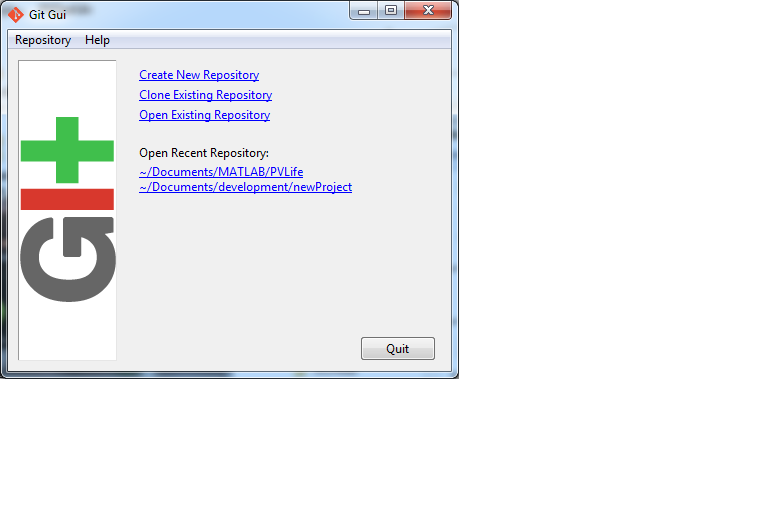
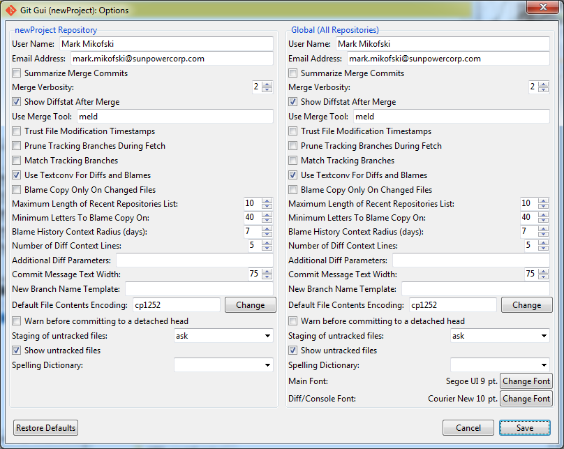
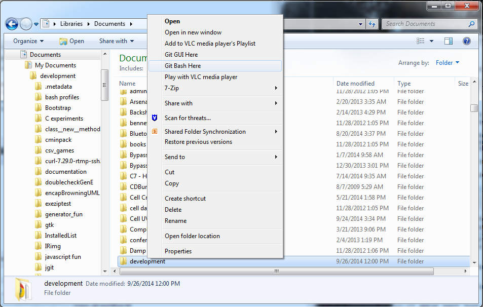
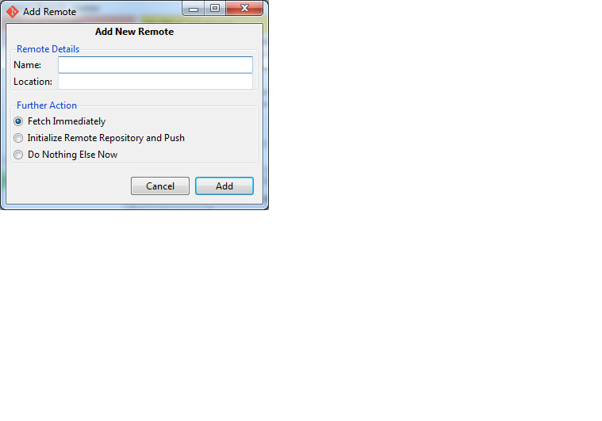
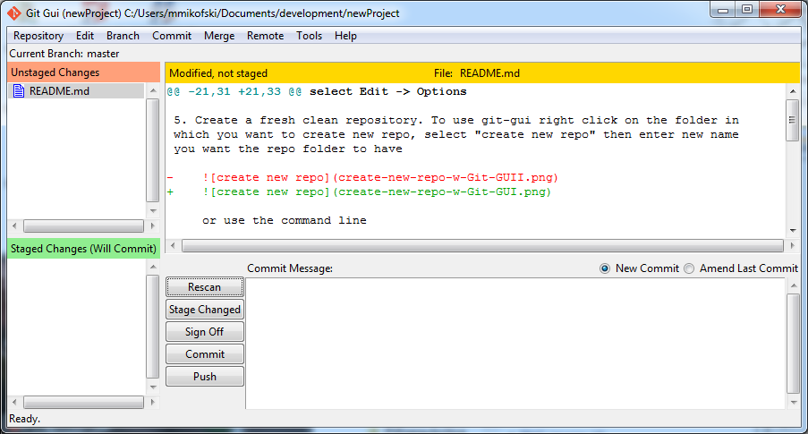
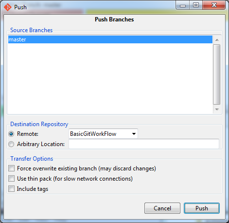
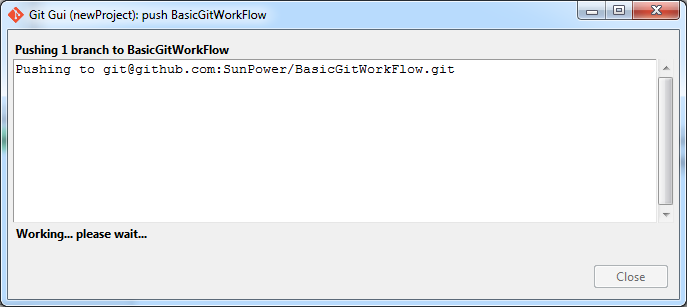
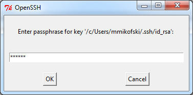
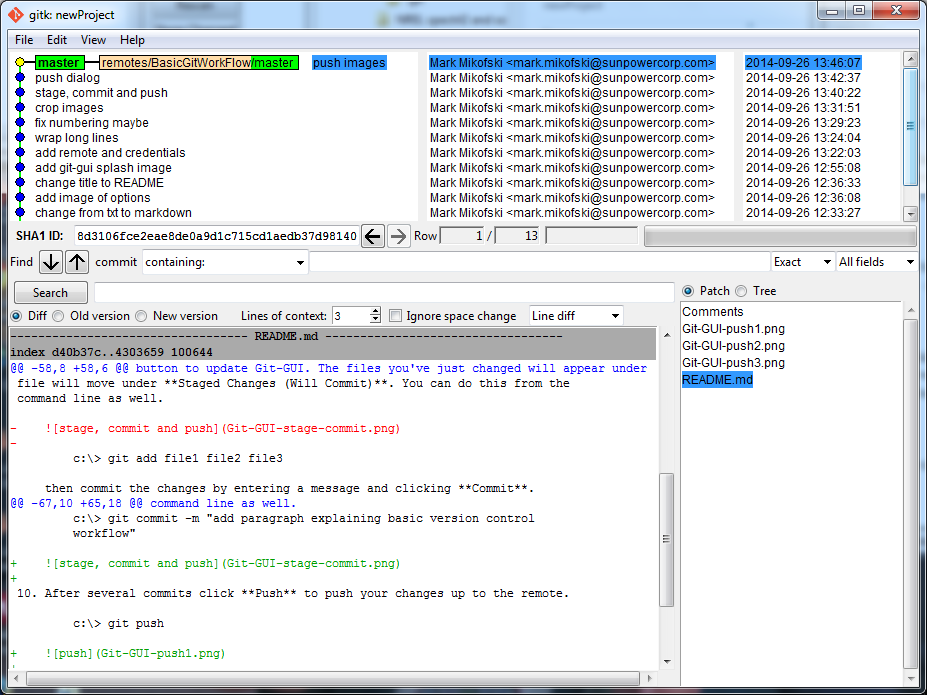

Resources
=========

* [ProGit book by Scott Chacon](http://git-scm.com/book)
* [Git reference docs](http://git-scm.com/doc)
* [GitHub help pages](https://help.github.com/)

Basic Git Work Flow
===================
1. Install a local client [msysgit](http://msysgit.github.io/).
This installs [Git](http://git-scm.com) which comes with GUI tools [Git-GUI](http://git-scm.com/docs/git-gui) and [gitk](http://git-scm.com/docs/git-gui).

    

2. Sign up for some remote repository service [Github](https://github.com/).
3. Create a new repository on Github or fork someone else's.
4. Add your email and name to msysgit from git-gui options, from the menu bar
select **Edit** -> **Options**.

    

5. Create a fresh clean repository. From Windows Explorer right click on the
folder in which you want to create new repo, select **Git-GUI**, then
**Create New Repository** then enter new name you want the repo folder to have.

    

    or use Git Bash.

        $ git init myNewRepo

6. Add a remote repository to your local repository. From Git-GUI menu bar
select **Remote** -> **Add...**

    

    Fill in the name you want the remote to be called when you pull from and
    push to it and the location of the remote. The location is its URL, and can
    be HTTPS or SSH. If you use HTTPS you will be prompted for your username
    and password everytime. If you have not set up two-factor authorization,
    then HTTPS will work fine. If you have set up two factor authorization then
    create a personal access token and use the token as your username and
    "x-oauth-basic" as your password.

    To use SSH, please set up keys according the instructions in [Pro-Git]
    (http://git-scm.com/book/en/Git-on-the-Server-Generating-Your-SSH-Public-Key)
    or [GitHub](https://help.github.com/articles/generating-ssh-keys). If you
    set a passphrase you will be prompted to enter it everytime.

7. Clone an existing repository.

        $ git clone https://github.com/SunPower/BasicGitWorkFlow

8. Do some work, eg write some docs, make some models, write some code, etc
9. Save your changes in the repository. From Git-GUI click the **Rescan**
button to update Git-GUI. The files you've just changed will appear under
**Unstaged Changes**. Clicking the icon for each file will _stage_ it, and the
file will move under **Staged Changes (Will Commit)**. You can do this from Git
Bash as well.

        $ git add file1 file2 file3

    then commit the changes by entering a message and clicking **Commit**.

        $ git commit -m "add paragraph explaining basic version control
        workflow"

    

10. After several commits click **Push** to push your changes up to the remote.

        $ git push

    

    

    

11. To see the history of your repository

    

    from Git-GUI menu bar select **Repository** -> **Visualize All Branch History**

12. Later when you're at a different laptop and want to make a quick change or
if you work with someone else, pull the changes from your other machine or your
coworker.

        $ git pull

13. You had a totally awesome idea, but you don't want to mess up your stuff
that is **finally** working so you create a branch

        $ git checkout -b myNewIdea

14. After working on your cool idea, you decide to bring it back into the fold,
you've been making changes and commiting them in your branch, so first return
to the main branch called master

        $ git checkout master

    then merge the changes from your "cool idea" branch

        $ git merge myNewIdea

15. Download a diff/merge tool so that you can view diffs and resolve merge
conflicts more easily.

    * [WinMerge](http://winmerge.org/)
    * [diffuse](http://diffuse.sourceforge.net/)
    * [Meld-Installer](http://sourceforge.net/projects/meld-installer/) 
    * [tkdiff](http://sourceforge.net/projects/tkdiff/)
    * [p4merge](http://www.perforce.com/product/components/perforce-visual-merge-and-diff-tools)

    You may need to configure from Git Bash using to use with [git-difftool]
    (http://git-scm.com/docs/git-difftool) or [git-mergetool]
    (http://git-scm.com/docs/git-mergetool). WinMerge will open conflict files
    without any configuration.
