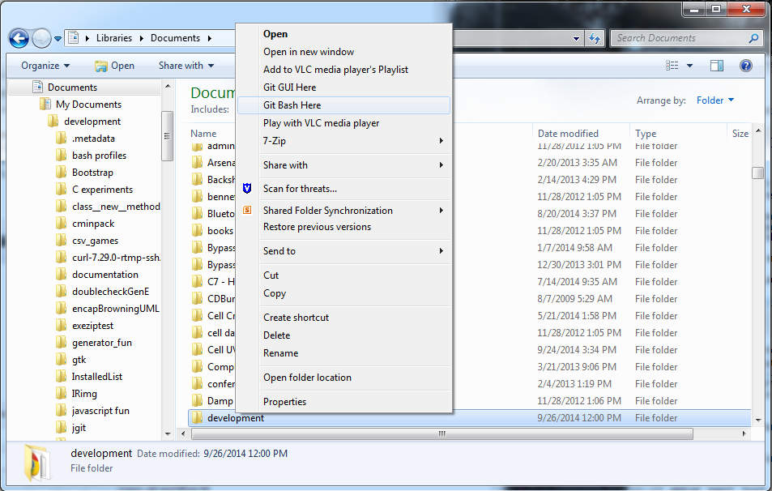

Resources
=========

* [ProGit book by scott chacon](http://git-scm.com/book)
* [Git reference docs](http://git-scm.com/doc)
* [GitHub help pages](https://help.github.com/)

Basic Git Work Flow
===================
1. install a local client [msysgit](http://msysgit.github.io/)
2. sign up for some remote repository service [Github](https://github.com/)
3. add your email and name to msysgit from git-gui options
4. create a fresh clean repository - to use git-gui right click on the folder in which you want to create new repo, select "create new repo" then enter new name you want the repo folder to have

    or use the command line

        c:\>git init my_new_repo

5. clone an existing one

        c:\> git clone https://github.com/SunPower/BasicGitWorkFlow

6. do some work, eg write some docs, make some models, write some code, etc
7. save your changes in the repository (git add file1 file2 file3) then (git commit -m "add paragraph explaining basic version control workflow")
8. after sever commits push your changes up to the remote (git push)
9. later when you're at a different laptop and want to make a quick change or if you work with someone else, pull the changes from [your other machine|your coworker] (git pull)
step Y: you had a totally awesome idea, but you don't want to f* up your stuff that is **finally** working so you create a branch (git checkout -b myNewIdea)
10. after working on your cool idea, you decide to bring it back into the fold, you've been making changes and commiting them in your branch, so first return to the main branch called master (git checkout master) then merge the changes from your "cool idea" branch (git merge myNewIdea)